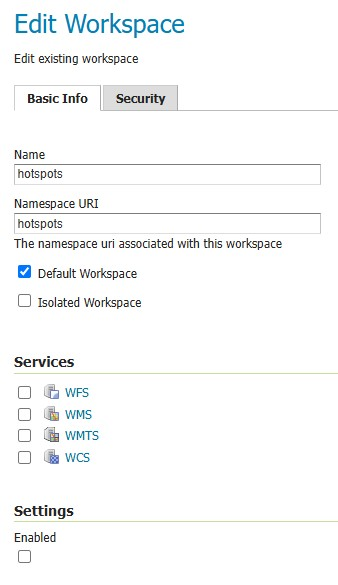
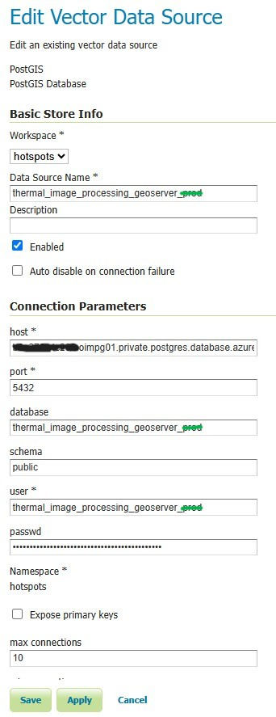
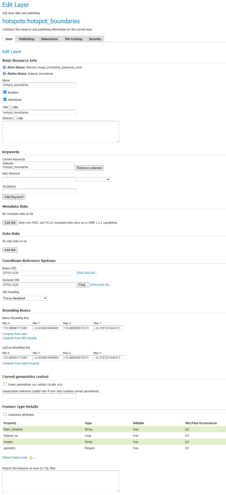
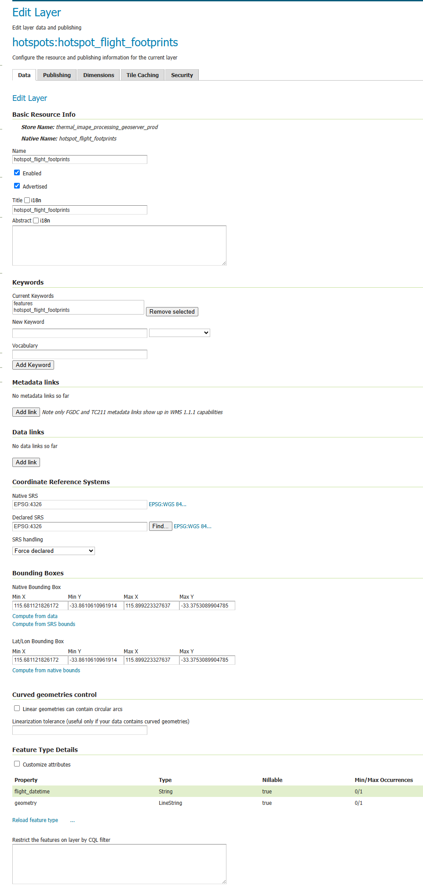
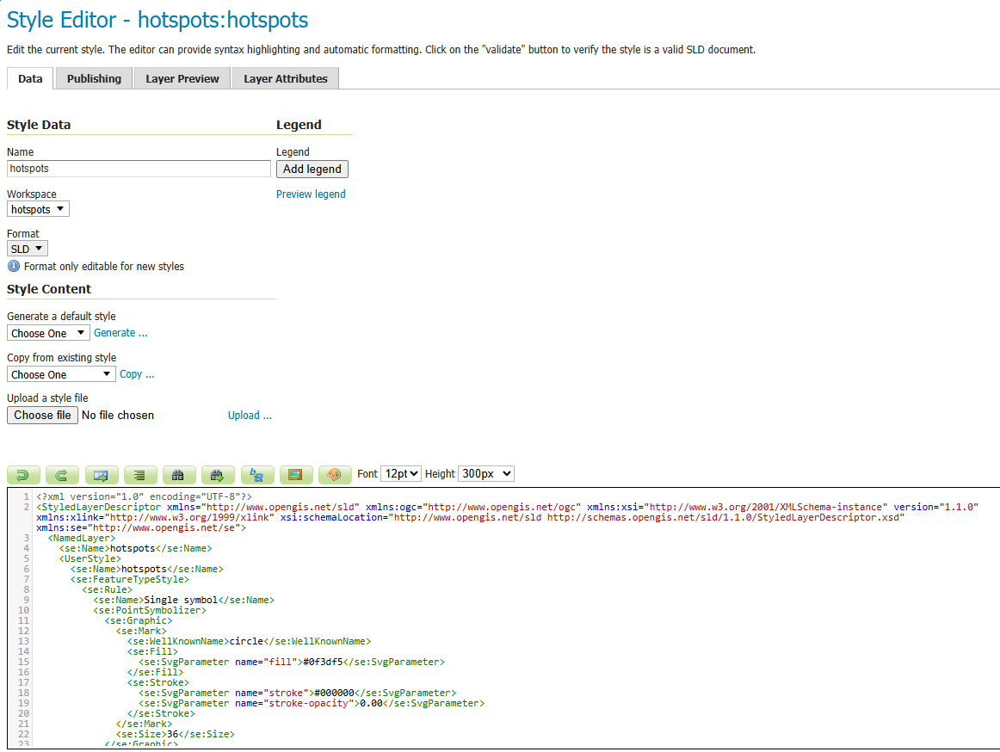

# Hotspots Geoserver

This document describes the GeoServer objects that must be pre-configured for the Thermal Image Processing system to function correctly.

---

## Overview

The system publishes processed thermal flight mosaics as GeoTIFF coverage layers in GeoServer. It also reads spatial vector data (hotspot boundaries, centroids, and flight footprints) from a PostGIS database, which GeoServer exposes as WMS/WFS layers.

GeoServer is accessed at the following URLs depending on the environment:

| Environment | GeoServer URL |
| :--- | :--- |
| **Development** | `https://<dev-url>/geoserver/` |
| **UAT** | `https://hotspots-uat.dbca.wa.gov.au/geoserver/` |
| **Production** | `https://hotspots.dbca.wa.gov.au/geoserver/` |

---

## 1. Workspace

| Property  | Value      |
|-----------|------------|
| Name      | `hotspots` |
| Namespace | `hotspots` |

All stores, layers, and styles described in this document must belong to this workspace.



---

## 2. Store (PostGIS DataStore)

| Property          | Value                                         |
|-------------------|-----------------------------------------------|
| Store name        | `thermal_image_processing_geoserver_<env>`     |
| Store type        | PostGIS                                       |
| Workspace         | `hotspots`                                    |
| Host              | <POSTGRES_HOST_ADDRESS>                       |
| Port              | `5432` (default)                              |
| Database          | <POSTGRES_DATABASE_NAME>                      |
| Schema            | `public`                                      |
| User              | <POSTGRES_USER_NAME>                          |
| Password          | <POSTGRES_PASSWORD>                           |

Environment Suffix (<env>):
- Development: thermal_image_processing_geoserver_dev
- UAT: thermal_image_processing_geoserver_uat
- Production: thermal_image_processing_geoserver_prod

This store provides access to the three vector tables that the processing pipeline writes to (see §3 below).



---

## 3. Layers (from PostGIS DataStore)

The following three layers must be published from the `thermal_image_processing_geoserver_<env>` PostGIS store. The underlying tables are created and populated automatically by the processing pipeline. Ensure the CRS is set to **EPSG:4326**.

### 3.1 `hotspot_boundaries`

| Property        | Value                                           |
|-----------------|-------------------------------------------------|
| Layer name      | `hotspot_boundaries`                            |
| Store           | `thermal_image_processing_geoserver_<env>`       |
| Table name      | `hotspot_boundaries`                            |
| Geometry type   | Polygon                                         |
| CRS             | EPSG:4326                                       |
| Description     | Polygon boundaries enclosing detected hotspot clusters per flight |

**Bounding Box Coordinates:**
- Min X: `115.699691772461`
- Min Y: `-33.8539619445801`
- Max X: `115.898559570313`
- Max Y: `-33.3787231445313`



### 3.2 `hotspot_centroids`

| Property        | Value                                           |
|-----------------|-------------------------------------------------|
| Layer name      | `hotspot_centroids`                             |
| Store           | `thermal_image_processing_geoserver_<env>`       |
| Table name      | `hotspot_centroids`                             |
| Geometry type   | Point                                           |
| CRS             | EPSG:4326                                       |
| Description     | Centroid points of detected hotspot clusters per flight |

**Bounding Box Coordinates:**
- Min X: `115.69970703125`
- Min Y: `-33.8539505004883`
- Max X: `115.89852142334`
- Max Y: `-33.3787307739258`


### 3.3 `hotspot_flight_footprints`

| Property        | Value                                           |
|-----------------|-------------------------------------------------|
| Layer name      | `hotspot_flight_footprints`                     |
| Store           | `thermal_image_processing_geoserver_<env>`       |
| Table name      | `hotspot_flight_footprints`                     |
| Geometry type   | LineString                                      |
| CRS             | EPSG:4326                                       |
| Description     | Bounding-box outline (as a closed LineString) of the full flight area |

**Bounding Box Coordinates:**
- Min X: `115.681121826172`
- Min Y: `-33.8610610961914`
- Max X: `115.899223327637`
- Max Y: `-33.3753089904785`



---

## 4. Style

### `hotspots`

| Property    | Value      |
|-------------|------------|
| Style name  | `hotspots` |
| Workspace   | `hotspots` |
| Format      | SLD        |

A named style called `hotspots` must exist in the `hotspots` workspace. This style is applied to hotspot vector layers for WMS rendering.

> The SLD definition for this style should be documented and version-controlled separately. The style must be uploaded to GeoServer before the layers listed in §3 are published.

#### SLD Source Code
```xml
<?xml version="1.0" encoding="UTF-8"?>
<StyledLayerDescriptor xmlns="http://www.opengis.net/sld" xmlns:ogc="http://www.opengis.net/ogc" xmlns:xsi="http://www.w3.org/2001/XMLSchema-instance" version="1.1.0" xmlns:xlink="http://www.w3.org/1999/xlink" xsi:schemaLocation="http://www.opengis.net/sld http://schemas.opengis.net/sld/1.1.0/StyledLayerDescriptor.xsd" xmlns:se="http://www.opengis.net/se">
  <NamedLayer>
    <se:Name>hotspots</se:Name>
    <UserStyle>
      <se:Name>hotspots</se:Name>
      <se:FeatureTypeStyle>
        <se:Rule>
          <se:Name>Single symbol</se:Name>
          <se:PointSymbolizer>
            <se:Graphic>
              <se:Mark>
                <se:WellKnownName>circle</se:WellKnownName>
                <se:Fill>
                  <se:SvgParameter name="fill">#0f3df5</se:SvgParameter>
                </se:Fill>
                <se:Stroke>
                  <se:SvgParameter name="stroke">#000000</se:SvgParameter>
                  <se:SvgParameter name="stroke-opacity">0.00</se:SvgParameter>
                </se:Stroke>
              </se:Mark>
              <se:Size>36</se:Size>
            </se:Graphic>
          </se:PointSymbolizer>
          <se:TextSymbolizer>
            <se:Label>
              <ogc:PropertyName>hotspot_no</ogc:PropertyName>              
            </se:Label>
            <se:Font>
              <se:SvgParameter name="font-family">Arial</se:SvgParameter>
              <se:SvgParameter name="font-size">24</se:SvgParameter>
              <se:SvgParameter name="font-style">normal</se:SvgParameter>
              <se:SvgParameter name="font-weight">bold</se:SvgParameter>
            </se:Font>
            <se:LabelPlacement>
              <se:PointPlacement>
                <se:AnchorPoint>
                  <se:AnchorPointX>0.5</se:AnchorPointX>
                  <se:AnchorPointY>0.5</se:AnchorPointY>
                </se:AnchorPoint>
              </se:PointPlacement>
            </se:LabelPlacement>
            <se:Fill>
              <se:SvgParameter name="fill">#ffffff</se:SvgParameter>
            </se:Fill>
          </se:TextSymbolizer>
        </se:Rule>
      </se:FeatureTypeStyle>
    </UserStyle>
  </NamedLayer>
</StyledLayerDescriptor>
```

