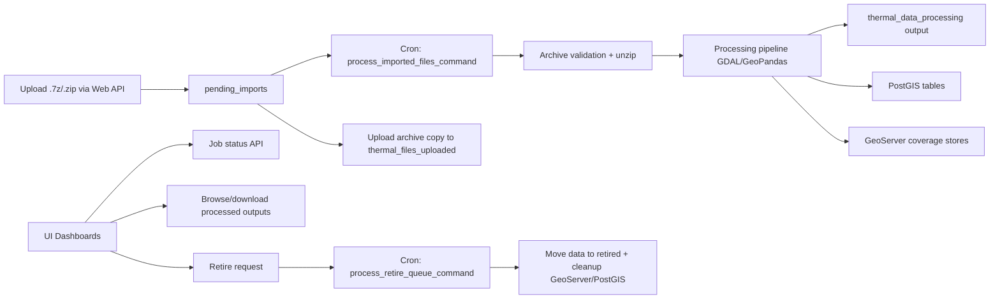

[[_TOC_]]

# Thermal Imaging (Hotspots)

## Overview

Thermal Image Processing is a Django-based system that ingests thermal flight archives (`.7z`/`.zip`), processes imagery into geospatial outputs, and publishes derived data for downstream mapping and operational use.

Primary responsibilities:

- Accept uploaded thermal flight archives.
- Validate archive structure before processing.
- Build mosaics and per-image geospatial products.
- Generate hotspot boundaries, centroids, and flight footprints.
- Persist geospatial vector records to PostGIS.
- Publish raster layers to GeoServer via REST.
- Provide web dashboards and API endpoints for monitoring, downloads, and retirement.

Code repository: <https://github.com/dbca-wa/thermal-image-processing>

## Environments

This document covers:

- Local development
- UAT
- Production

Known application URLs:

- UAT App: <https://thermal-imaging-processing-oim03.dbca.wa.gov.au/>
- UAT GeoServer: <https://hotspots-uat.dbca.wa.gov.au/geoserver/rest/workspaces/hotspots/coveragestores/>
- Production App: <https://thermal-imaging-processing.dbca.wa.gov.au/>
- Production GeoServer: <https://hotspots.dbca.wa.gov.au/geoserver/rest/workspaces/hotspots/coveragestores/>

Notes:

- API endpoints are available under the application URLs (e.g., `/api/processing-jobs/`).

# System Architecture

## Technology Stack

- Python 3 (container image runtime)
- Django 5.x
- Django REST Framework
- Gunicorn + gevent
- PostgreSQL/PostGIS (via `psycopg2` and `GeoAlchemy2`)
- GDAL / Fiona / GeoPandas / Shapely for geospatial processing
- GeoServer (vector and raster publication target)
- Azure Pipelines + Docker image publishing

## High-Level Flow

## Core Components

- Web application: `tipapp` (views, APIs, permissions, templates, management UI).
- Processing engine: `thermalimageprocessing/thermal_image_processing.py`.
- Import orchestrator: `tipapp/imports_processor.py`.
- Job model: `tipapp.models.ThermalProcessingJob`.
- Periodic execution: `python-cron` + `django-cron` jobs.

# Deployment

## Container Runtime

- Entrypoint script: `startup.sh`
- Web server: Gunicorn on port `8080` (configured in `gunicorn.ini`)
- Optional cron runtime controlled by `ENABLE_CRON`
- Optional web runtime controlled by `ENABLE_WEB`

Default startup behaviour:

1. Optionally start scheduler (`/bin/scheduler.py`) when `ENABLE_CRON=True`.
2. Optionally start Gunicorn when `ENABLE_WEB=True`.

## CI/CD (Azure Pipelines)

Pipeline file: `azure-pipelines.yml`

On push to `main`, the pipeline builds and pushes:

- Production image: `dbcawa/thermal-image-processing` (tags: `latest`, date tag)
- Dev image: `dbcawa/docker_app_dev` (tags: `thermal_image_processing_dev_latest`, date tag)

Important operational point:

- Dependency or code changes require a new image build. Restarting an existing container alone does not apply updated packages.

## Data Paths and Volumes

Configurable paths (default under project root):

- `PENDING_IMPORT_PATH` -> `pending_imports/`
- `DATA_STORAGE` -> `thermal_data_processing/`
- `RETIRED_STORAGE` -> `thermal_data_processing/retired/`
- `DOWNLOADS_PATH` -> `thermal_downloads/`
- `UPLOADS_HISTORY_PATH` -> `thermal_files_uploaded/`

At startup, missing directories are created automatically.

# Security and Access Model

## Authentication and Authorisation

- SSO middleware: `dbca_utils.middleware.SSOLoginMiddleware`
- Optional Django login route controlled by `ENABLE_DJANGO_LOGIN`
- Group-based role model:
  - `Admin` group: upload/delete/retire actions
  - `Officers` group: view/monitor/download actions

## API Safety Controls

The file browsing and download endpoints enforce path safety checks to block traversal attacks by validating that requested paths remain within approved base directories.

# Data Model

## ThermalProcessingJob Lifecycle

Main statuses:

- `QUEUED`
- `PROCESSING`
- `COMPLETED`
- `FAILED`
- `RETIRE_QUEUED`
- `RETIRING`
- `RETIRED`
- `RETIRE_FAILED`

Important fields include:

- `flight_name` (unique identifier)
- `original_filename`, `file_path`, `file_size`
- progress and step tracking fields
- processing timestamps
- retirement tracking fields
- output and error metadata

# API and UI Surfaces

## Main UI Pages

- `/upload-monitor` (also root `/`)
- `/files-dashboard`
- `/uploads-history`

## Key API Endpoints

- `POST /api/upload-files/thermal_files/`
- `GET /api/upload-files/list_pending_imports/`
- `POST /api/upload-files/api_delete_thermal_file/`
- `GET /api/thermal-files/list_thermal_folder_contents/`
- `GET /api/thermal-files/list_uploaded_files/`
- `GET /api/thermal-files/download/`
- `GET /api/processing-jobs/`
- `GET /api/processing-jobs/<id>/`
- `POST /api/processing-jobs/<id>/reset/`
- `POST /api/processing-jobs/<id>/retire/`

# Scheduled Processing

## Cron Schedule (`python-cron`)

- Every 5 minutes: `process_imported_files_command`
- Every 10 minutes: `mark_stuck_jobs_command`
- Every 2 minutes: `runcrons` (includes django-cron jobs)
- Daily log rotation

## django-cron Jobs

- District sync from KB: daily at `02:00`
- Retirement queue processor: every 1 minute

# Environment Variables

Below is the current inferred set from source code. Values and secrets must be provided by environment management (not committed).

## Required for Basic Runtime

- `SECRET_KEY`
- `DATABASE_URL`

## Common Runtime and Security

- `DEBUG`
- `ALLOWED_HOSTS`
- `CSRF_TRUSTED_ORIGINS`
- `TIME_ZONE` (default: `Australia/Perth`)

## Feature Toggles and App Behaviour

- `ENABLE_WEB`
- `ENABLE_CRON`
- `ENABLE_DJANGO_LOGIN`
- `MANAGEMENT_COMMANDS_PAGE_ENABLED`
- `DASHBOARD_AUTO_REFRESH_INTERVAL`
- `DIR_SIZE_CACHE_TTL`

## Email and Notifications

- `EMAIL_HOST`
- `EMAIL_PORT`
- `EMAIL_INSTANCE`
- `NON_PROD_EMAIL`
- `PRODUCTION_EMAIL`
- `EMAIL_DELIVERY`
- `NOTIFICATION_RECIPIENTS`

## Observability

- `SENTRY_DSN`
- `SENTRY_SAMPLE_RATE`
- `SENTRY_TRANSACTION_SAMPLE_RATE`
- `ENABLE_SQL_LOGGING`

## Geospatial and External Integrations

- `general_postgis_table` (PostGIS connection string for processing pipeline)
- `general_districts_dataset_name`
- `general_districts_layer_name`
- `general_districts_kb_url` (optional override)
- `general_file_url_base` (GeoServer external file URL base)
- `general_gs_url_base` (GeoServer REST coverage store base URL)
- `geoserver_user`
- `geoserver_password`

## Job Reliability / Testing

- `STUCK_JOB_TIMEOUT_HOURS`
- `TEST_THERMAL_PROCESSING_FAILURE` (test/fault-injection usage)

## Optional / Legacy-looking (verify before use)

- `DEV_APP_BUILD_URL`
- `APPLICATION_VERSION`
- `WEBHOOK_ENABLED`
- `general_container_name`

Notes:

- This list is inferred from source code. Verify which variables are mandatory versus optional for each environment.
- Consider adding a canonical `.env.example` file to the repository aligned with runtime and deployment manifests.

# GeoServer and Spatial Requirements

GeoServer prerequisites and layer/style setup are documented in the [Hotspots Geoserver](Hotspots-Geoserver) subpage.

Minimum assumptions used by this system:

- Workspace `hotspots` exists.
- Coverage store operations are permitted via GeoServer REST.
- PostGIS layers are available for hotspot vectors.
- Shared raster storage mount is available at `/rclone-mounts/thermalimaging-flightmosaics`.

# Local Development

## Prerequisites

- Python environment compatible with project dependencies
- GDAL/GEOS native libraries
- PostgreSQL/PostGIS
- Access to required environment variables

## Typical Setup

1. Create and activate a virtual environment.
2. Install dependencies: `pip install -r requirements.txt`
3. Configure `.env` with required values.
4. Run migrations: `python manage.py migrate`
5. Run server: `python manage.py runserver 0.0.0.0:9001`

Optional local commands:

- `python manage.py process_imported_files_command`
- `python manage.py process_retire_queue_command`
- `python manage.py mark_stuck_jobs_command`
- `python manage.py sync_districts_from_kb`

# Operations Runbook (Concise)

## Upload and Process

1. Upload archive from `/upload-monitor`.
2. Confirm job enters `QUEUED` then `PROCESSING`.
3. Verify completion state `COMPLETED`.
4. Validate outputs in processed storage and dashboard listings.

## Retire a Flight

1. Queue retire action in UI/API.
2. Cron picks up `RETIRE_QUEUED` jobs.
3. Verify data moved to retired archive.
4. Verify GeoServer and PostGIS cleanup.
5. Confirm final status `RETIRED` or investigate `RETIRE_FAILED`.

## Recover Stuck Jobs

1. Use `mark_stuck_jobs_command` (or wait for schedule).
2. Inspect logs and `error_message` on job record.
3. Re-queue via reset/retire workflow as required.

# Logging and Troubleshooting

Primary log locations:

- `logs/tip_app.log`
- `logs/tip_app_sql.log` (if enabled)
- `logs/gunicorn.log`
- `logs/process_imported_files_command.log`
- `logs/mark_stuck_jobs_command.log`
- `logs/cronjob.log`

Common failure points:

- Invalid archive structure or flight naming.
- Missing GeoServer credentials/permissions.
- PostGIS connection or schema mismatch.
- Missing district GeoPackage or invalid layer name.
- Interrupted processing leading to stuck jobs.

# Open Items

- Confirm final authoritative environment variable matrix per environment (mandatory vs. optional).
